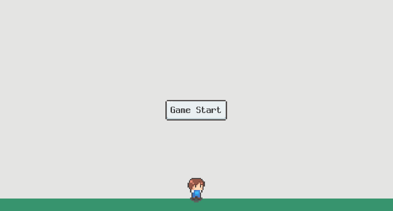
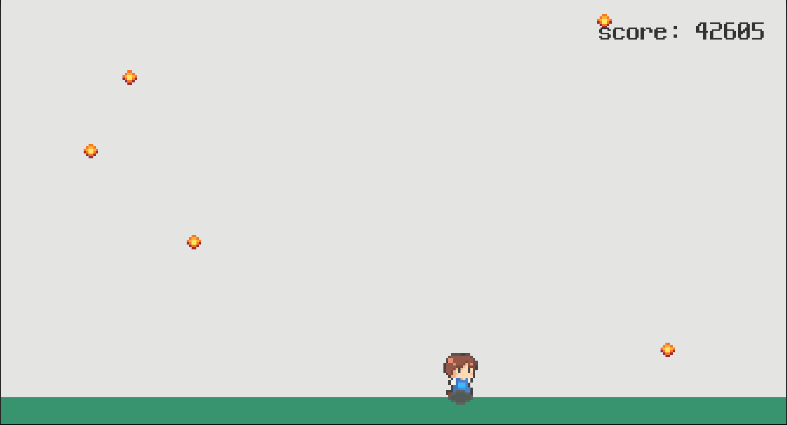
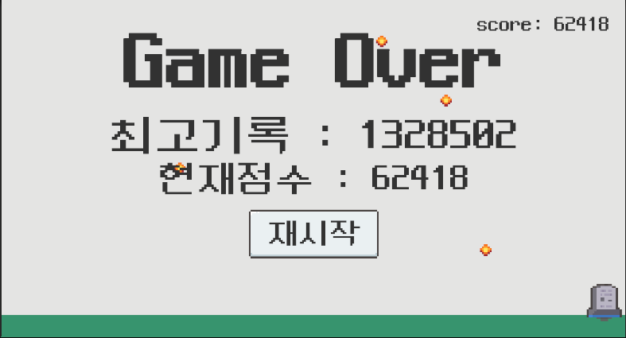

## 🌧️ Rain Dodge Game

### 📖 게임 소개
기초 연습용 게임 -
하늘에서 떨어지는 비를 피하며 최대한 오래 생존하는 2D 아케이드 게임입니다.

### 🎮 게임 플레이
- **목표**: 떨어지는 비를 피해 최대한 오래 생존
- **조작**: A/D 키 또는 방향키로 좌우 이동
- **점수**: 시간과 레벨에 따라 자동으로 증가
- **난이도**: n초마다 레벨업하며 비가 더 빠르게 떨어짐
- **최고기록**: 자동으로 저장되어 다음 게임에서 확인 가능

### 🛠️ 기술 스택
- **Engine**: Unity 6.0 (6000.0.48f1)
- **Language**: C#
- **Input System**: Unity New Input System
- **Physics**: 2D Rigidbody

### ⚙️ 주요 기능
- **오브젝트 풀링**: 성능 최적화를 위한 비 오브젝트 재사용
- **레벨 시스템**: 시간에 따른 난이도 증가
- **점수 시스템**: 실시간 점수 계산 및 최고점수 저장
- **애니메이션**: 캐릭터 이동 및 사망 애니메이션
- **UI 시스템**: 게임 시작, 게임오버, 재시작 인터페이스

### 📁 프로젝트 구조
```
Assets/
├── 01. Scenes/
├── 02. Scripts/
│   ├── GameManager.cs      # 게임 전체 관리
│   ├── PlayerController.cs # 플레이어 이동 및 애니메이션
│   ├── RainManager.cs      # 비 오브젝트 풀링 관리
│   ├── RainSpawner.cs      # 비 생성 로직
│   ├── Rain.cs             # 비 충돌 처리
│   ├── HUD.cs              # 점수 UI 표시
│   └── AchieveManager.cs   # 최고점수 관리
└── 03. Prefabs/
```

### 🎨 게임 화면
- 게임 시작 화면

- 인게임 플레이 화면

- 게임오버 및 최고점수 화면


### 📝 개발 노트
- Unity New Input System 활용
- 물리 기반 캐릭터 이동 (AddForce)
- PlayerPrefs를 통한 데이터 저장
- 코루틴을 활용한 게임 상태 관리

---
**개발 기간**: 1일  


